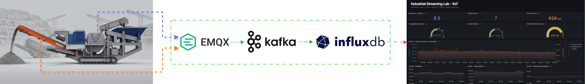
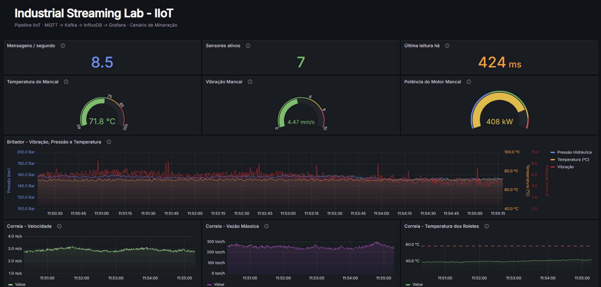

# 🏭 Industrial Streaming Lab

**Pipeline completo de streaming industrial em ambiente local — do sensor ao dashboard em tempo real.**

Lab de estudo open source que demonstra uma arquitetura de streaming de dados industriais, integrando MQTT, Apache Kafka, InfluxDB e Grafana em um cenário IIoT (Industrial Internet of Things) inspirado em ambientes de mineração.

> 🎓 **Projeto de estudo.** O objetivo é explorar conceitos de arquiteturas de streaming aplicadas a dados industriais. Para uso em produção, ajustes adicionais de segurança, escalabilidade e tolerância a falhas são necessários.

---

## 📐 Arquitetura



*Visão geral do fluxo de dados — do equipamento industrial ao dashboard. 
Os sensores (simulados com Node-RED no projeto) publicam via MQTT no broker EMQX, são encaminhados ao Kafka por uma bridge Python, consumidos por outro serviço Python e gravados no InfluxDB, de onde alimentam o dashboard Grafana em tempo real.*

### Fluxo Detalhado
```
[Node-RED] → [EMQX] → [Bridge Python] → [Kafka] → [Consumer Python] → [InfluxDB] → [Grafana]
```
### Fluxo de dados

1. **Node-RED** simula sensores industriais de dois equipamentos de mineração e publica mensagens JSON em tópicos MQTT
2. **EMQX** (broker MQTT) recebe e distribui as mensagens
3. **Bridge MQTT-Kafka** (Python) lê do MQTT e publica no Kafka
4. **Apache Kafka** atua como log distribuído de eventos, permitindo replay e múltiplos consumidores
5. **Consumer Python** lê do Kafka, processa e grava no InfluxDB
6. **InfluxDB** armazena os dados como séries temporais
7. **Grafana** consulta o InfluxDB e exibe dashboards em tempo real

---

## ⛏️ Cenário simulado — mineração

O lab simula um cenário simplificado de **chão de fábrica em uma planta de mineração**, com dois equipamentos críticos da cadeia produtiva:

### Equipamento 1 — Britador de Mandíbula (`JAW-CRUSHER-01`)

Primeira etapa de redução de tamanho do minério bruto que chega da mina.

| Sensor | Faixa típica | Unidade | Frequência |
|---|---|---|---|
| `temperature_bearing` | 50–85 | °C | 1s |
| `pressure_hydraulic` | 120–180 | bar | 1s |
| `vibration` | 2–8 | mm/s | 500ms |
| `power_motor` | 200–450 | kW | 1s |

### Equipamento 2 — Correia Transportadora (`BELT-CONVEYOR-01`)

Transporta o material britado para a próxima etapa do processamento.

| Sensor | Faixa típica | Unidade | Frequência |
|---|---|---|---|
| `belt_speed` | 1.5–3.5 | m/s | 500ms |
| `load_weight` | 50–300 | ton/h | 1s |
| `temperature_roller` | 30–65 | °C | 2s |

**Total: 7 sensores publicando continuamente (~8.5 mensagens/segundo agregadas)**

Frequências de publicação foram escolhidas para evidenciar a capacidade da arquitetura de processar volume sustentado. Em um cenário industrial real, essas frequências representariam dados agregados de um *edge gateway* consolidando leituras de múltiplos pontos de coleta antes de transmiti-los à camada central.

---

## 🛠️ Stack Técnica

| Componente | Tecnologia | Versão | Função |
|---|---|---|---|
| Simulador de sensores | Node-RED | 3.x | Gerar dados industriais simulados |
| Broker MQTT | EMQX Open Source | 5.x | Receber mensagens dos sensores |
| Streaming platform | Apache Kafka | 7.6 (KRaft) | Log distribuído de eventos |
| Bridge MQTT-Kafka | Python + paho-mqtt + confluent-kafka | 3.11+ | Ponte entre MQTT e Kafka |
| Consumer | Python + confluent-kafka + influxdb-client | 3.11+ | Consumir Kafka e gravar no InfluxDB |
| Time-series database | InfluxDB | 2.7 | Armazenar dados temporais |
| Visualização | Grafana | 11.x | Dashboards em tempo real |
| Kafka UI | Provectus Kafka UI | latest | Interface visual do cluster Kafka |
| Orquestração | Docker Compose | 2.x | Orquestrar todos os serviços |

---

## 📋 Pré-requisitos

- **Docker** 24.0+
- **Docker Compose** v2+
- **Memória disponível:** mínimo 4 GB livres para os containers
- **Portas livres:** 1880, 1883, 3000, 8080, 8083, 8086, 9092, 18083

> 💡 Nenhuma instalação local de Python, Kafka, MQTT etc. é necessária — tudo roda em containers.

---

## 🚀 Como executar

### 1. Clonar o repositório

```bash
git clone https://github.com/HenriqueGuis/lab-iiot-01-streaming-pipeline.git
cd lab-iiot-01-streaming-pipeline
```

### 2. Subir todos os serviços

```bash
docker compose up -d
```

Aguarde alguns minutos para todos os serviços iniciarem (especialmente Kafka, que demora ~30s para ficar healthy na primeira vez).

### 3. Verificar status

```bash
docker compose ps
```

Todos os serviços devem estar com status `Up` — os que possuem healthcheck (kafka, emqx, influxdb, node-red) devem aparecer como `(healthy)`.

### 4. Acessar as interfaces

| Serviço | URL | Credenciais padrão |
|---|---|---|
| Node-RED | http://localhost:1880 | (sem autenticação no lab) |
| EMQX Dashboard | http://localhost:18083 | `admin` / `public` |
| Kafka UI | http://localhost:8080 | (sem autenticação no lab) |
| InfluxDB UI | http://localhost:8086 | `admin` / `industrial-lab-2026` |
| Grafana | http://localhost:3000 | `admin` / `admin` |

### 5. Importar o flow no Node-RED

1. Acesse http://localhost:1880
2. Menu superior direito → **Import** → selecione o arquivo `node-red/mining-sensor-simulator.json`
3. Clique em **Deploy**
4. Os 7 sensores começam a publicar dados imediatamente

### 6. Verificar o pipeline funcionando

**Bridge MQTT-Kafka** (logs):

```bash
docker compose logs -f mqtt-kafka-bridge
```

Você deve ver `Conectado ao MQTT broker emqx:1883` e `Subscrito em: plant/+/area/+/equipment/+/sensor/+`.

**Consumer Kafka-InfluxDB** (logs):

```bash
docker compose logs -f kafka-influxdb-consumer
```

**Dashboard Grafana**: acesse http://localhost:3000 → Dashboards → "Industrial Streaming Lab — Mineração"

O dashboard já vem provisionado automaticamente — não é necessário criar manualmente.

---

## 📁 Estrutura do projeto

```
lab-iiot-01-streaming-pipeline/
├── docker-compose.yml          # Orquestração de todos os serviços
├── README.md                   # Este arquivo
├── LICENSE                     # Licença MIT
├── .gitignore
├── bridge/                     # Bridge MQTT → Kafka
│   ├── Dockerfile
│   ├── main.py
│   └── requirements.txt
├── consumer/                   # Consumer Kafka → InfluxDB
│   ├── Dockerfile
│   ├── main.py
│   └── requirements.txt
├── node-red/
│   └── mining-sensor-simulator.json    # Flow do simulador (mineração)
├── grafana/
│   ├── provisioning/                   # Auto-provisionamento
│   │   ├── datasources/
│   │   │   └── influxdb.yml
│   │   └── dashboards/
│   │       └── default.yml
│   └── dashboards/
│       └── industrial-streaming-mining.json    # Dashboard exportado
├── docs/
│   ├── architecture.md         # Decisões arquiteturais
│   ├── topics-schema.md        # Schemas de tópicos MQTT/Kafka/InfluxDB
│   ├── learnings.md            # Aprendizados técnicos
│   └── claude-project-memory.md    # Memória técnica do projeto
└── assets/                     # Diagramas e screenshots
```

---

## 🔍 Estrutura de tópicos

### MQTT (hierarquia de ativos)

Os tópicos seguem o padrão de hierarquia de ativos comum em ambientes industriais:

```
plant/{plant_id}/area/{area_id}/equipment/{equipment_id}/sensor/{sensor_id}
```

**Exemplos do cenário de mineração:**

```
plant/01/area/BRITAGEM/equipment/JAW-CRUSHER-01/sensor/temperature_bearing
plant/01/area/BRITAGEM/equipment/JAW-CRUSHER-01/sensor/vibration
plant/01/area/TRANSPORTE/equipment/BELT-CONVEYOR-01/sensor/belt_speed
plant/01/area/TRANSPORTE/equipment/BELT-CONVEYOR-01/sensor/load_weight
```

**Payload (JSON):**

```json
{
  "timestamp": "2026-05-13T14:30:00.123Z",
  "plant_id": "01",
  "area_id": "BRITAGEM",
  "equipment_id": "JAW-CRUSHER-01",
  "equipment_type": "jaw_crusher",
  "sensor_id": "vibration",
  "value": 5.23,
  "unit": "mm/s",
  "quality": "good"
}
```

### Kafka (tópicos)

Os tópicos MQTT são mapeados para um único tópico Kafka, mantendo o caminho original em um header:

- **Tópico Kafka:** `industrial-sensors`
- **Key:** `{plant_id}-{equipment_id}-{sensor_id}` (para particionamento estável)
- **Value:** payload JSON original
- **Headers:** `mqtt-topic` (caminho MQTT original)

> Veja [`docs/topics-schema.md`](docs/topics-schema.md) para detalhes completos.

---

## 📊 Dashboard Grafana

O dashboard "Industrial Streaming Lab — Mineração" é provisionado automaticamente e inclui:


**Linha 1 — KPIs do pipeline**
- Mensagens por segundo processadas
- Sensores ativos
- Latência da última leitura

**Linha 2 — Estado atual (Gauges)**
- Temperatura do mancal
- Vibração
- Potência do motor

**Linha 3 — Histórico do Britador**
- Painel multi-série com vibração, pressão hidráulica e temperatura do mancal (eixos independentes)

**Linha 4 — Histórico da Correia Transportadora**
- Três painéis lado a lado: velocidade da correia, vazão mássica e temperatura dos roletes

Thresholds visuais semânticos sinalizam zonas de operação normal, atenção e crítica em cada painel.

---

## 🎓 Aprendizados técnicos

Os principais aprendizados do desenvolvimento estão documentados em [`docs/learnings.md`](docs/learnings.md), incluindo:

- Diferenças entre MQTT (pub/sub) e Kafka (log distribuído) — quando usar cada um
- Estruturação de tópicos por hierarquia de ativos industriais
- Particularidades do Kafka em modo KRaft (Cluster ID como UUID base64)
- QoS do MQTT vs garantias do Kafka — balanço entre performance e confiabilidade
- Field Overrides do Grafana para visualizar múltiplas escalas no mesmo painel

---

## 🗺️ Próximo projeto da série

Este lab é o **primeiro de uma série** de projetos focados em arquiteturas de dados industriais.

**Próximo projeto: Kafka em produção (`lab-iiot-02-kafka-production`)**

O segundo projeto evolui esta arquitetura para um ambiente mais próximo do que se vê em operações industriais reais, adicionando:

- **Cluster Kafka com múltiplos brokers** — substituindo a configuração de broker único atual. Em produção industrial, múltiplos brokers garantem **alta disponibilidade**: se um broker cair, os outros continuam atendendo. Também distribuem carga, permitindo throughput muito maior.

- **Tópicos particionados com replicação** — partições permitem **paralelismo de processamento** (múltiplos consumidores trabalhando simultaneamente em fatias diferentes dos dados). Replicação garante que cada partição existe em mais de um broker, prevenindo perda de dados em caso de falha.

- **Monitoramento avançado do Kafka** — métricas de throughput, lag de consumidores, saúde dos brokers, status das partições. Integração com Prometheus e novos painéis no Grafana específicos para o cluster Kafka.

- **Estratégias de tolerância a falhas** — comportamento do sistema quando brokers caem, consumidores travam, ou mensagens chegam fora de ordem. Demonstração prática de conceitos como ISR (In-Sync Replicas), commit de offsets e idempotência de produtores.

O objetivo é dar continuidade ao aprendizado em arquiteturas de streaming, focando agora em **resiliência e escala** — competências fundamentais para projetos industriais reais.

---

## 🤖 Sobre o desenvolvimento

Este projeto foi desenvolvido com apoio do Claude (Anthropic) como pair programmer e mentor técnico. O uso de IA generativa foi consciente e deliberado: utilizei o Claude para acelerar pesquisa técnica, debater decisões de arquitetura, revisar código e estruturar documentação.

**Áreas em que o Claude apoiou o desenvolvimento:**

- Debate de trade-offs arquiteturais (MQTT direto vs MQTT + Kafka; estruturação de tópicos por hierarquia de ativos)
- Estruturação inicial dos Dockerfiles e do `docker-compose.yml`
- Esboço inicial dos scripts Python da bridge e do consumer
- Estratégia de simulação dos sensores (frequências, estado interno, modelagem de picos de vibração)
- Configuração de Field Overrides no Grafana para múltiplas escalas
- Revisão e refinamento da documentação

**Por que o Claude é parte do projeto, não apenas uma ferramenta auxiliar:**

A escolha de manter o Claude como parte do fluxo de trabalho é estratégica. A ferramenta funciona como uma memória técnica viva do projeto: cada decisão de arquitetura, cada trade-off avaliado e cada aprendizado documentado fica disponível para consulta nas próximas iterações da série. Quando o projeto 2 (Kafka multi-broker e particionamento) for desenvolvido, o Claude poderá recuperar o contexto técnico construído aqui, mantendo coerência arquitetural e acelerando o ciclo de pesquisa-implementação.

A memória completa das decisões e do raciocínio técnico construídos ao longo deste projeto está disponível em [`docs/claude-project-memory.md`](docs/claude-project-memory.md), permitindo retomar o contexto em qualquer momento do ciclo de evolução do lab.

---

## 🤝 Contribuindo

Este é um projeto de estudo e contribuições da comunidade são bem-vindas.

- **Achou um bug?** Abra uma issue
- **Tem uma sugestão de melhoria?** Abra uma issue ou pull request
- **Quer trocar ideia sobre arquiteturas industriais?** Conecte-se comigo no [LinkedIn](https://www.linkedin.com/in/henriqueguis/)

---

## 📚 Referências

- [MQTT Specification 5.0](https://docs.oasis-open.org/mqtt/mqtt/v5.0/mqtt-v5.0.html)
- [Apache Kafka Documentation](https://kafka.apache.org/documentation/)
- [EMQX Documentation](https://www.emqx.io/docs/en/latest/)
- [InfluxDB 2.x Documentation](https://docs.influxdata.com/influxdb/v2/)
- [Grafana Documentation](https://grafana.com/docs/)
- [Node-RED Documentation](https://nodered.org/docs/)
- [ISA-95 Standards](https://www.isa.org/standards-and-publications/isa-standards/isa-standards-committees/isa95)

---

## 📄 Licença

Este projeto está sob a licença MIT — veja o arquivo [LICENSE](LICENSE) para detalhes.

---

## 👤 Autor

**Henrique Guimarães**
Engenheiro de Dados Industriais | IIoT

🔗 [LinkedIn](https://www.linkedin.com/in/henriqueguis/) · 🐙 [GitHub](https://github.com/HenriqueGuis)
